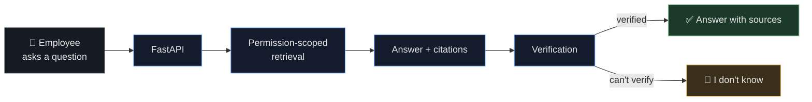
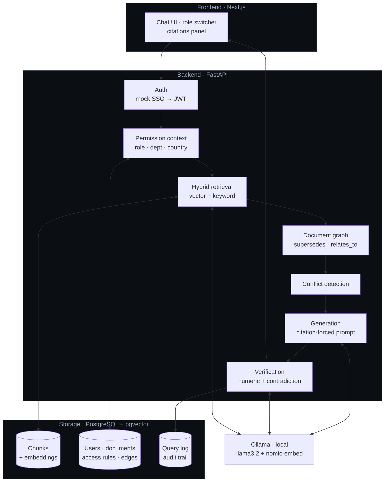
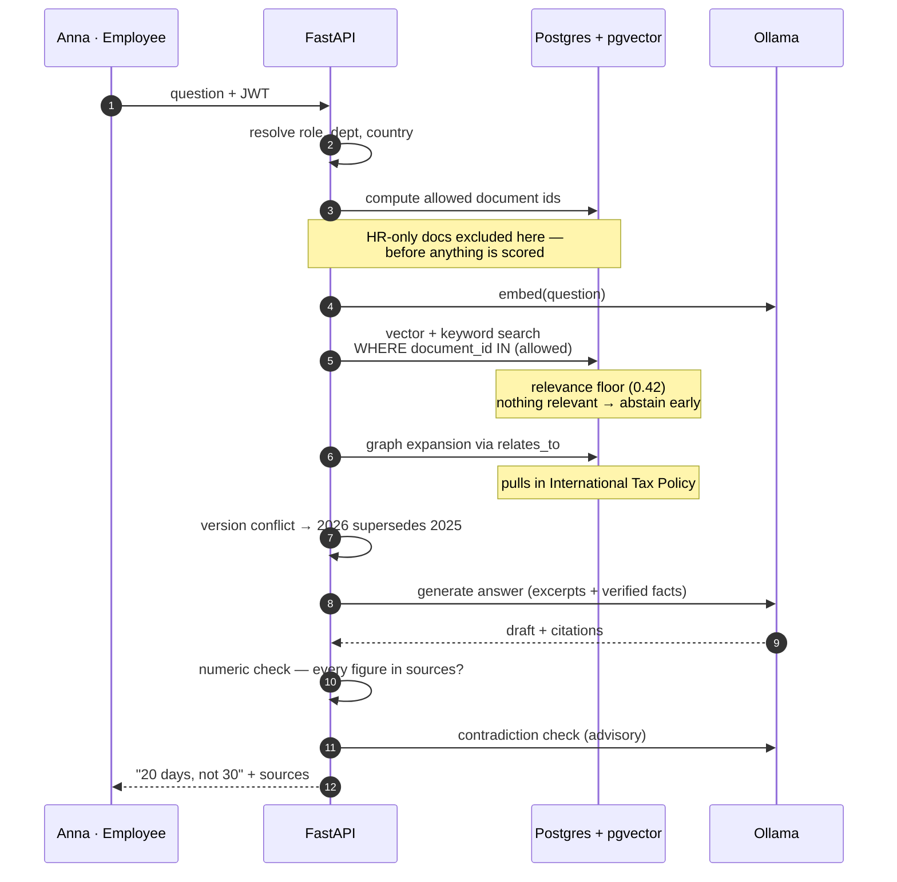
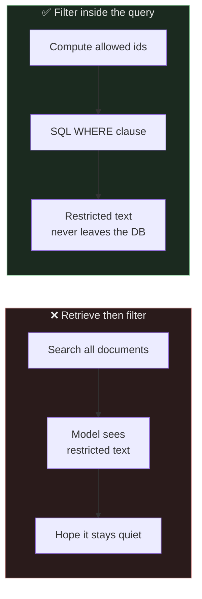
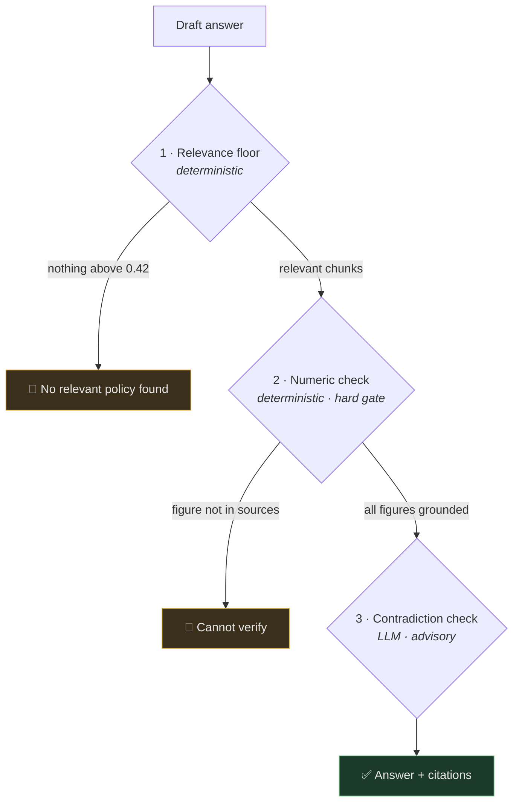

# Enterprise Policy Copilot

A permission-aware RAG system for internal company policy questions — where **access control is enforced inside retrieval, not bolted on afterwards**, versions resolve automatically through a document graph, and the system abstains instead of guessing.

The premise: in a policy assistant, a confidently wrong answer or a leaked salary document is worse than no answer at all. Everything below follows from that.



---

## What makes this different from a standard RAG demo

| | Standard RAG | This system |
|---|---|---|
| **Access control** | Retrieve everything, filter or prompt afterwards | Filter applied *inside* the SQL query — unauthorized text is never fetched, never scored, never sent to the model |
| **Document versions** | All versions look equally relevant to similarity search | A `supersedes` graph resolves which version is current, deterministically |
| **Multi-document answers** | Hope the right chunks land in top-k | `relates_to` edges pull in required companion documents |
| **Hallucination** | Ask the model nicely to stay grounded | Relevance floor + deterministic numeric check + contradiction check |

---

## Architecture



---

## How a question flows through the system

Walking the headline case: **Anna (Employee, Germany) asks "Can I work remotely from Turkey for 30 days?"**



**What Anna is told:** the current 2026 policy allows 20 days, this replaced the 30-day 2025 version, and Turkey being outside the EU means HR approval is required.

**What she is never told:** that an HR-only guideline permits 40-day exceptions. That document was excluded at step 3 — the model never saw it, so it cannot leak it.

---

## The permission boundary

The single most important design decision — where the check happens:



One prompt injection defeats the left-hand design. The right-hand one holds because it is a database constraint, not a request to a probabilistic system. `backend/tests/permission_tests.py` asserts this under adversarial phrasing and is treated as a deployment gate.

---

## Three-layer abstention

Each layer catches a failure the others miss:



Layer 1 was the one that mattered most in practice — without it, an uncovered question ("can I expense a home office chair?") retrieved four unrelated policies and the model invented a *"Retail Credit Card Policy"* to cite. Layer 3 is advisory at the current model size because a 3B model produced false rejections; see [`docs/IMPLEMENTATION.md`](./docs/IMPLEMENTATION.md) §4b.

---

## Stack

Fully open-source and self-hosted — no API keys, runs offline.

| Layer | Choice |
|---|---|
| Backend | Python · FastAPI · SQLAlchemy |
| LLM + embeddings | Ollama — `llama3.2:3b`, `nomic-embed-text` (direct HTTP, **no LangChain**) |
| Storage | PostgreSQL + pgvector — vectors, full-text, relational data and graph edges in one database |
| Frontend | Next.js · React · TypeScript |

Writing the retrieval, conflict and verification logic directly rather than through a framework is deliberate: for this project the interesting part *is* that logic, and it stays debuggable.

---

## Running it

Postgres and the API run in Docker. **Ollama and the frontend run natively** — this is not stylistic:

- Docker on macOS cannot reach the Metal GPU, so containerized inference falls back to CPU — measured at **122s vs 4.6s** for the same generation.
- `npm install` and Next.js rebuilds over a bind mount are drastically slower than on the host.

On a Linux host with an NVIDIA GPU, use the `containerized-llm` and `containerized-ui` compose profiles instead.

```bash
# 1 · Ollama, natively (first run pulls models)
OLLAMA_HOST=127.0.0.1:11435 ollama serve &
OLLAMA_HOST=127.0.0.1:11435 ollama pull llama3.2:3b
OLLAMA_HOST=127.0.0.1:11435 ollama pull nomic-embed-text

# 2 · Postgres + API
docker compose up -d --build

# 3 · Schema and seed data
docker exec -it policy-copilot-api alembic upgrade head
docker exec -it policy-copilot-api python -m app.ingestion.seed

# 4 · Frontend
cd frontend && npm install && npm run dev
```

App → http://localhost:3000 · API docs → http://localhost:8000/docs

### Tests

```bash
docker exec -it policy-copilot-api pytest tests/ -v
```

16 tests: permission boundaries (the security gate), retrieval quality and version resolution, plus an end-to-end golden set.

---

## Try it

The UI ships with role-specific example prompts, each labelled with what it demonstrates — switching roles swaps the list.

The demo worth seeing first: ask **"Can I work remotely from Turkey for 30 days?"** as **Anna Employee**, then again as **Helena HR**. The answer changes, because retrieval itself is permission-scoped — not the presentation layer.

---

## Documentation

| Document | Contents |
|---|---|
| [`docs/PLAN.md`](./docs/PLAN.md) | System design — architecture, ingestion, RBAC/ABAC, permission-aware retrieval, versioning, conflict handling, abstention, evaluation, observability, scaling, security, and a 4-week MVP scope |
| [`docs/IMPLEMENTATION.md`](./docs/IMPLEMENTATION.md) | Tech stack decisions with rationale, repo layout, data model, build order — and §4b, three problems that only surfaced once it was running |
| [`docs/DEMO_SCENARIOS.md`](./docs/DEMO_SCENARIOS.md) | Seed documents, demo users, and the scripted walkthrough behind the UI's example prompts |
